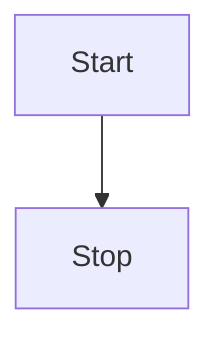
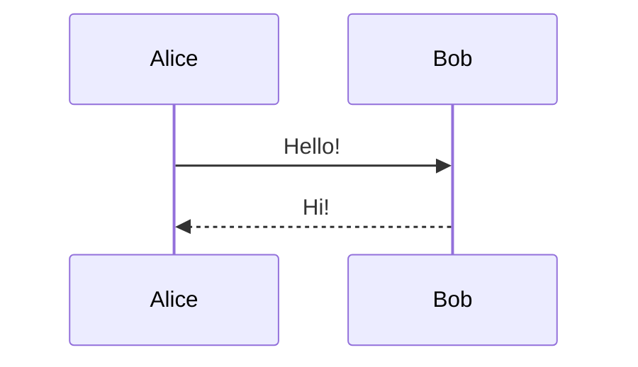
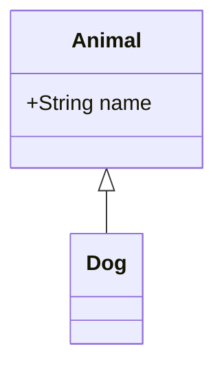

# Quick Start Guide

Get the Mermaid PowerPoint Plugin running in 5 minutes!

## Prerequisites Check

Before starting, verify you have:
- ✅ Node.js installed: `node --version` (should be v16+)
- ✅ npm installed: `npm --version`
- ✅ PowerPoint (Microsoft 365, 2016+, or PowerPoint Online)

## Installation (3 steps)

### 1. Install Dependencies
```bash
npm install
```

### 2. Generate SSL Certificates
```bash
npx office-addin-dev-certs install
```
*You may need to enter your password to trust the certificate*

### 3. Start the Server
```bash
npm start
```
*Keep this terminal window open!*

## Load in PowerPoint (2 steps)

### 1. Open PowerPoint
- Create a new presentation or open an existing one

### 2. Sideload the Add-in

**Windows/Mac:**
1. Go to **Insert** → **Get Add-ins** (or **My Add-ins**)
2. Click **Upload My Add-in**
3. Select `manifest.xml` from this project folder
4. Click **Upload**

**PowerPoint Online:**
1. Go to **Insert** → **Add-ins** → **More Add-ins**
2. Click **Upload My Add-in**
3. Select `manifest.xml`
4. Click **Upload**

## Use the Plugin

1. Look for **"Mermaid Diagrams"** in the **Home** tab
2. Click **"Create Diagram"** button
3. The task pane opens on the right
4. Select a diagram type (Flowchart, Sequence, or Class)
5. Edit the Mermaid code
6. Click **"Insert into Slide"**

## Example Diagrams

### Simple Flowchart


### Sequence Diagram


### Class Diagram


## Troubleshooting

**Add-in won't load?**
- Ensure `npm start` is running
- Check that you selected the correct `manifest.xml` file
- Try restarting PowerPoint

**Certificate error?**
- Run: `npx office-addin-dev-certs install --force`
- Restart PowerPoint

**Diagram won't render?**
- Check Mermaid syntax
- Try one of the example diagrams from the dropdown

## Next Steps

- Read the full [README.md](README.md) for features and syntax
- Check [SETUP_GUIDE.md](SETUP_GUIDE.md) for detailed troubleshooting
- Visit [Mermaid.js docs](https://mermaid.js.org/) for syntax reference

## Need Help?

Open an issue on GitHub with:
- Your PowerPoint version
- Operating system
- Error messages
- Steps to reproduce

Happy diagramming! 🎨