# Mermaid Diagram Plugin for PowerPoint

A **PowerPoint** add-in that allows you to create beautiful diagrams using Mermaid.js syntax directly in your presentations.
That plugin has been designed by IBM Bob.

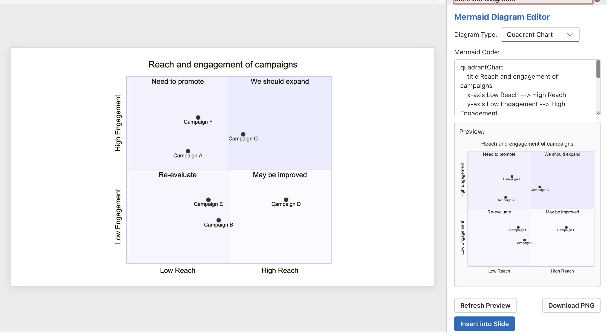

## Features

- **Multiple Diagram Types**: Support for flowcharts, sequence diagrams, class diagrams, quadrant charts, and architecture diagrams (C4)
- **Live Preview**: See your diagram render in real-time as you type
- **Mermaid.js Syntax**: Use the popular Mermaid.js markdown-inspired syntax
- **SVG Export**: Diagrams are inserted as high-quality SVG images
- **Easy to Use**: Simple interface with pre-loaded examples

## Supported Diagram Types

### Flowcharts
Create process flows, decision trees, and workflow diagrams.

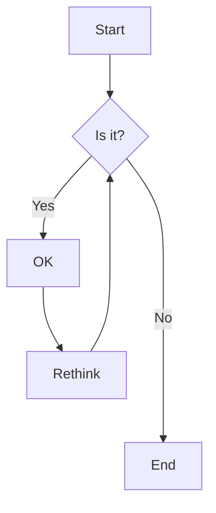

### Sequence Diagrams
Visualize interactions between different actors or systems.

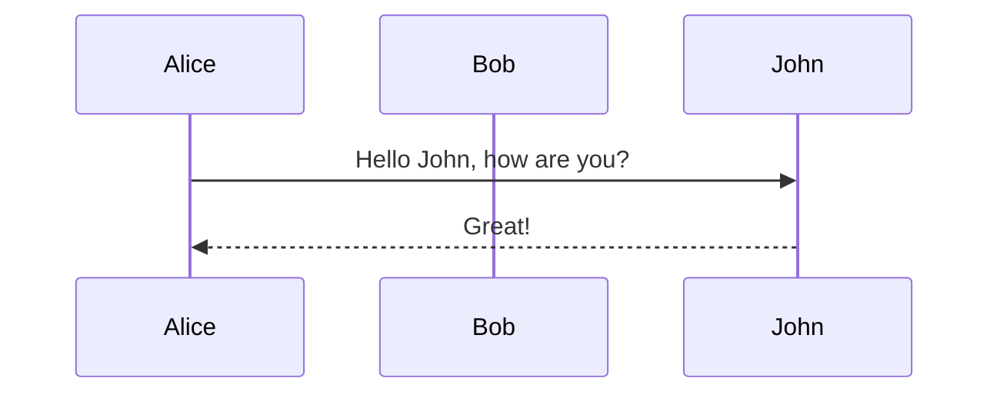

### Class Diagrams
Model object-oriented systems and relationships.

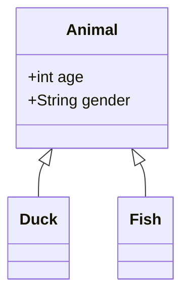

### Quadrant Charts
Visualize data across two dimensions with four quadrants.

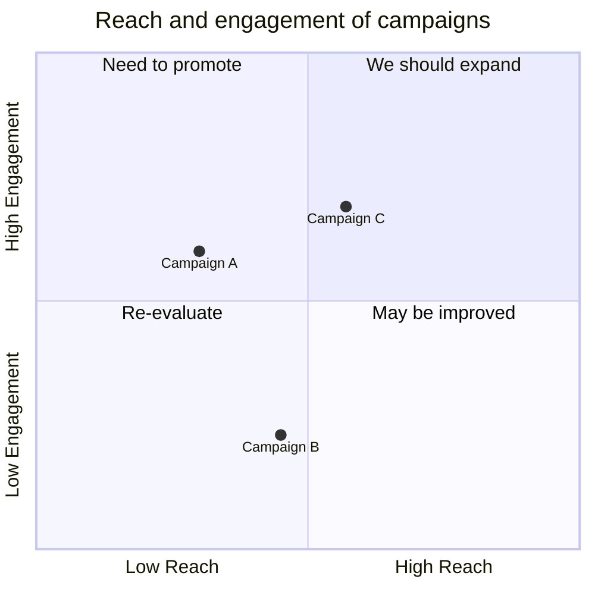

### Architecture Diagrams (C4)
Create system context and architecture diagrams using C4 model notation.

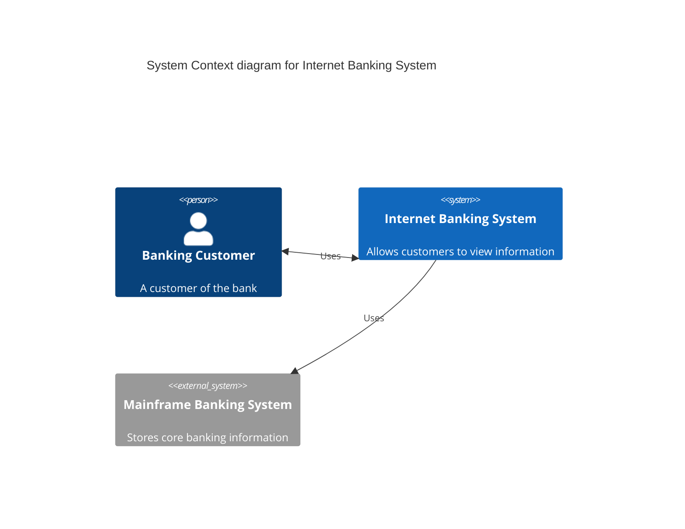

## Installation

### Prerequisites
- Node.js (v16 or higher)
- npm or yarn
- PowerPoint (Microsoft 365 or PowerPoint 2016+)

### Setup

1. Clone the repository:
```bash
git clone https://github.com/vperrinfr/Mermaid4Powerpoint.git
cd Mermaid4Powerpoint
```

2. Install dependencies:
```bash
npm install
```

3. Generate SSL certificates for local development:
```bash
npx office-addin-dev-certs install
```

4. Start the development server:
```bash
npm start
```

5. Sideload the add-in in PowerPoint:
   - Open PowerPoint
   - Go to Insert > Get Add-ins > Upload My Add-in
   - Browse to the `manifest.xml` file in your project directory
   - Click Upload

## Usage

1. **Open the Plugin**: Click on the "Create Diagram" button in the Home tab
2. **Select Diagram Type**: Choose from Flowchart, Sequence, Class, Quadrant Chart, or Architecture (C4) diagram
3. **Edit Code**: Modify the Mermaid syntax in the text editor
4. **Preview**: The diagram updates automatically in the preview pane
5. **Insert**: Click "Insert into Slide" to add the diagram to your current slide

## Development

### Project Structure
```
mermaid-powerpoint-plugin/
├── src/
│   ├── taskpane/
│   │   ├── App.tsx          # Main React component
│   │   ├── App.css          # Styles
│   │   ├── index.tsx        # Entry point
│   │   └── taskpane.html    # HTML template
│   └── commands/
│       ├── commands.ts      # Command handlers
│       └── commands.html    # Commands HTML
├── assets/                  # Icons and images
├── manifest.xml            # Add-in manifest
├── webpack.config.js       # Webpack configuration
├── tsconfig.json          # TypeScript configuration
└── package.json           # Dependencies
```

### Build Commands

- `npm start` - Start development server with hot reload
- `npm run build` - Build for production
- `npm run dev` - Start dev server and open in browser
- `npm run validate` - Validate manifest.xml

### Technologies Used

- **TypeScript**: Type-safe JavaScript
- **React**: UI framework
- **Fluent UI**: Microsoft's design system
- **Mermaid.js**: Diagram rendering engine
- **Office.js**: PowerPoint integration API
- **Webpack**: Module bundler

## Mermaid Syntax Reference

### Flowchart Basics
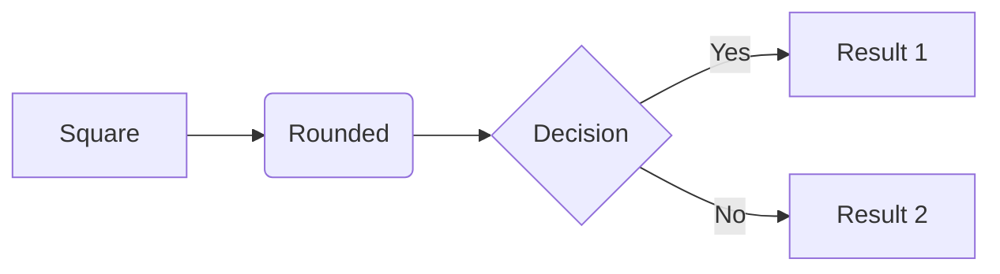

### Sequence Diagram Basics
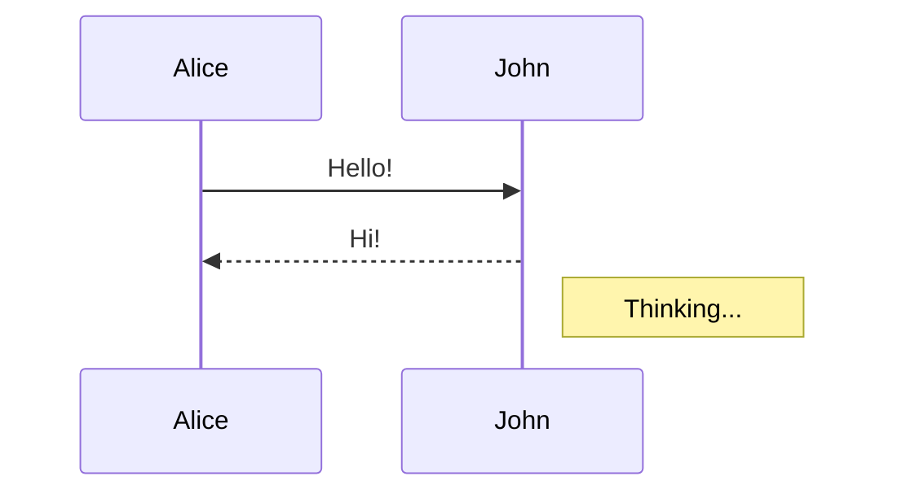

### Class Diagram Basics
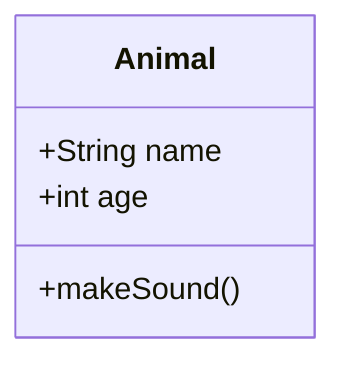

### Quadrant Chart Basics
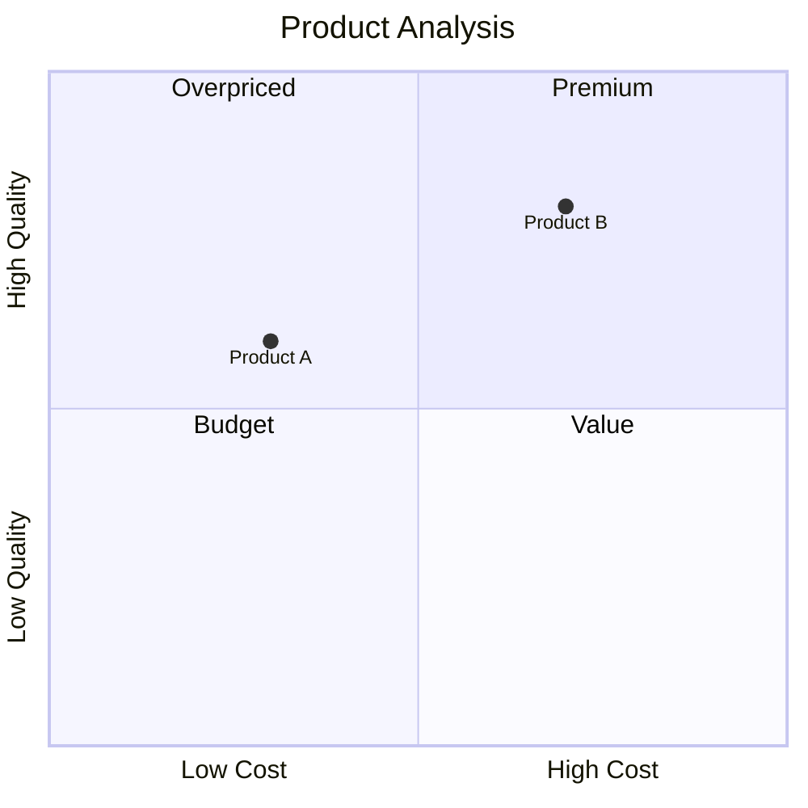

### Architecture Diagram Basics (C4)
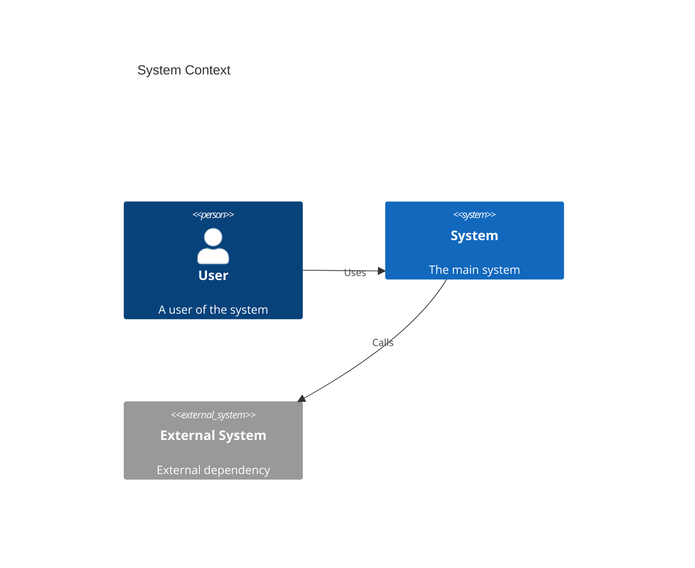

For complete Mermaid syntax documentation, visit: https://mermaid.js.org/

## Troubleshooting

### Add-in doesn't load
- Ensure the development server is running (`npm start`)
- Check that SSL certificates are installed
- Verify manifest.xml is valid (`npm run validate`)

### Diagram doesn't render
- Check Mermaid syntax for errors
- Look at browser console for error messages
- Try one of the example diagrams

### Can't insert diagram
- Ensure you have a slide selected in PowerPoint
- Check that the diagram rendered successfully in preview
- Verify PowerPoint has write permissions

## Contributing

Contributions are welcome! Please feel free to submit a Pull Request.

## License

MIT License - see LICENSE file for details

## Support

For issues and questions:
- GitHub Issues: https://github.com/vperrinfr/Mermaid4Powerpoint/issues
- Mermaid.js Documentation: https://mermaid.js.org/

## Roadmap

- [ ] Add more diagram types (Gantt, ER, State, etc.)
- [ ] Support for custom themes and styling
- [ ] Diagram editing after insertion
- [ ] Export diagrams to various formats
- [ ] Collaborative diagram editing
- [ ] Template library

## Acknowledgments

- [Mermaid.js](https://mermaid.js.org/) - The amazing diagram rendering library
- [Office.js](https://docs.microsoft.com/en-us/office/dev/add-ins/) - Microsoft Office Add-ins platform
- [Fluent UI](https://developer.microsoft.com/en-us/fluentui) - Microsoft's design system
